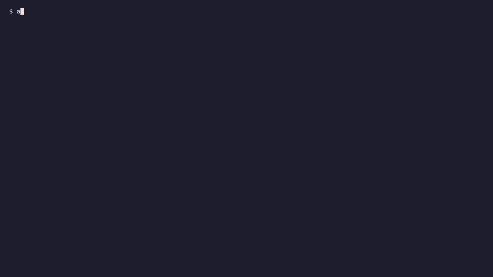

# assay

[](https://github.com/joeyvictorino/assay/actions/workflows/ci.yml)

**In plain English.** Companies are starting to point AI models at their own
systems to hunt for security weaknesses. Two problems follow: a model will
sometimes report a weakness that is not there, and afterwards nobody can prove
what the AI actually did. assay is a test harness for that. It lets several
different AI models examine the same deliberately vulnerable practice system,
but only through tools whose definitions are digitally signed and only inside a
signed list of allowed targets. It does not believe what a model says: every
claimed weakness is re-tested by ordinary code, and a claim is marked
"validated" only if that code reproduces it. Every request and decision goes
into a tamper-evident log, and the harness measures how much the models'
findings overlap and how many of the planted weaknesses each one found.

**Technically.** A multi-model continuous security-validation harness, written in
Go (Apache-2.0). It routes each task to the best model, runs several models over
the same authorized targets, measures how little their findings overlap,
validates exploitability in a sandbox, chains findings into attack paths,
generates remediations, and records every model call, tool call and decision in
an AES-256-GCM, hash-chained audit log, with zero transcript retention by
default. Tool manifests are Ed25519-signed and checked against a trust store,
the policy engine is deny-wins, the scope gate fails closed, validators are
deterministic, and the design is recorded in 17 ADRs (`docs/adr`).



## 60-second demo

No API key, no model, no outbound network. You need Go 1.26 or newer and `curl`;
the first build downloads Go modules if they are not cached.

```
git clone https://github.com/joeyvictorino/assay && cd assay
./scripts/demo.sh
```

It builds the harness and `synthetic-ops` (a lab with 15 planted weaknesses),
starts the lab on `127.0.0.1:9000`, and walks through six steps: signed tool
manifests verify; the policy denies a read-only agent that asks to write; the
signed scope allows the lab and refuses `example.com`; the harness runs against
the lab with the scripted `fake` provider; a plain-English summary of the result
is printed; and the audit log's hash chain verifies, then fails after one
character of one record is changed. Everything is stopped and removed when it
ends. Measured on an Apple-silicon Mac with warm Go caches: about 6 seconds of
CPU time, 6 to 15 seconds of wall-clock time depending on how busy the machine
was. The first run on a machine that has never built the project also downloads
modules and compiles the dependencies (the pure-Go SQLite driver and the
Anthropic SDK are the large ones); one cold-cache run used about 290 CPU-seconds
on a heavily loaded machine, so plan on minutes for that first run.

The part of the summary that matters:

```
  findings    2 reported: 2 validated, 0 theorized, 0 refuted
              validated  security-headers   GET  /              low, 2 checker observations
              validated  verbose-error      GET  /api/boom      low, 2 checker observations
  tool calls  4 claimed by the model, each matched against the control-plane log; 0 mismatches
  vs. truth   fake-model@synthetic-ops: 2 of 15 planted weaknesses found, 0 false positives
  audit log   26 records, hash-chain head f1efab1f799e5424...
```

What this does and does not show. The `fake` provider is a script: it reports two
findings chosen in advance (`internal/cli/run_fake.go`), so the demo says nothing
about how good any model is. What it exercises is everything around the model:
the checkers re-test each of those two findings against the live lab and mark
them validated on their own evidence, every claimed tool call is matched to the
control-plane log, and the audit chain is verifiable. To see real models, look at
the next section.

## Latest committed result

Run `20261010-092639-5600c802`
([CI run 38041295991](https://github.com/joeyvictorino/assay/actions/runs/38041295991/attempts/1)):
three small open-weight models, run locally on a CI runner's CPU, each assessing
three vulnerable labs independently. No API keys and no frontier models.

| Model | Findings (validated / theorized) | Precision | Recall |
| --- | ---: | ---: | ---: |
| Ministral 3 3B | 2 / 1 | 0.667 | 0.133 |
| Qwen2.5 3B | 1 / 4 | 0.250 | 0.067 |
| Llama 3.2 3B | 0 / 1 | 0.000 | 0.000 |

Together the three models reported 9 distinct findings and no finding was
reported by more than one model (intersection 0). Precision and recall are
against the 15 planted weaknesses of `synthetic-ops`, the one lab with a
complete ground-truth list.

Limits, stated plainly:

- These are 3B-class models at 4-bit on a CI runner's CPU with an 8-turn limit.
  This is not a result about frontier models and says little about which small
  model is better.
- It is one run. There are no repeats, so run-to-run variance is unmeasured.
  Two earlier single-model runs of Qwen2.5 3B (`results/20261007-215749-7290ba88`
  and `results/20261008-010140-7420e126`, different commits) validated 3
  findings in one and none in the other.
- Precision 0.667 is 2 correct findings out of 3 reported. Samples this small
  carry no statistical weight, and "no overlap" among 9 findings from weak
  models does not predict how stronger models would agree.
- 3 of the 9 lab-by-model assessments ended on a time limit with nothing
  reported (Qwen and Ministral on juice-shop, Ministral on dvwa), and Llama
  never returned a self-score on any lab.
- The labs are intentionally vulnerable software, and one of them
  (`synthetic-ops`) is this repository's own. Numbers describe recovery of known
  weaknesses, not accuracy on real systems.

Every figure is recomputable from committed files:
`python3 scripts/check_overlap.py results/20261010-092639-5600c802` regenerates
the overlap matrix from the per-model findings, and CI does so for every
committed run. `results/README.md` has the full table and the two superseded
runs. A run with frontier models needs API keys; the procedure is
[docs/frontier-run.md](docs/frontier-run.md).

## Install

Release binaries for macOS and Linux (amd64, arm64) with `checksums.txt` are on the
[releases page](https://github.com/joeyvictorino/assay/releases). Or build from source:

```
go install github.com/joeyvictorino/assay/cmd/assay@v0.3.0
```

## Run the pipeline by hand

`scripts/demo.sh` wraps these commands. The pull-request pipeline in CI runs the
same ones against the repository's own synthetic lab with a scripted provider,
so they need no network and no API key:

```
go build -o assay ./cmd/assay
(cd labs/synthetic-ops && go build -o ../../synthetic-ops ./cmd/synthetic-ops)
./synthetic-ops -addr 127.0.0.1:9000 &
./assay run --config runs/pr.yaml --mode full --out out --lab synthetic-ops \
  --ephemeral-audit-key --run-id demo
./assay audit verify --log .audit/demo.log
```

`assay run` refuses to start without a trust store, verified tool manifests, a
policy and a signed scope document. `scope/ci.yaml` is signed with the key in
`trust/keys`; to point it at other targets, sign your own with `assay scope sign`.

## Results

Every committed run lives under `results/<run-id>/` with the CI run that
produced it; `results/README.md` describes the files and how to regenerate the
overlap matrix. The dashboard is at
[joeyvictorino.github.io/assay/dashboard](https://joeyvictorino.github.io/assay/dashboard/).

`python3 scripts/calibration.py` prints, for every committed run with
self-reflection records, each model's own scores beside what the checkers then
said about its findings and its recall where a lab has complete ground truth.

## Status

- **Checked by deterministic code (validated or refuted):** security headers,
  verbose errors, CORS, open redirect, reflected and stored XSS, information
  disclosure, sensitive files, missing and bypassed authentication, IDOR,
  default credentials, SQL injection, path traversal, weak JWT configuration,
  mass assignment, missing rate limiting, CSRF and SSRF. Each check is
  non-destructive and needs two consistent observations.
- **Theorized only:** any finding whose class has no checker (`other`), and any
  finding a checker could not confirm.
- **Self-reflection:** each model scores its own report and revises when the
  score is below 7, at most twice (ADR 0017). The score gates revision only,
  and a model grading itself is a biased judge; the scores are recorded so
  that bias can be measured once runs with several real models exist.
- **Shown with small local models only:** a three-model overlap result and
  per-model precision and recall (`results/README.md`).
- **Not yet shown:** an overlap result or precision and recall for frontier
  models (needs API keys; see `docs/frontier-run.md`), and an upstream adopter
  of the signed-manifest design.
- **Zero data retention** is a tested property of this harness (an end-to-end
  test plants a canary in lab responses, model text and prompts and scans the
  disk after a run). Providers apply their own retention terms to the calls
  the harness sends; that is governed by the provider agreement and not
  claimed here.

## Principles

- Authorized targets only. A signed scope document gates every outbound
  request; the gate fails closed.
- A technical claim is not evidence. Findings start as *theorized* and
  become *validated* or *refuted* only through deterministic checks.
- Zero data retention is a tested property, not a README sentence.
- Every statistic published here is reproducible from committed code and
  committed or regenerable data.

## License

Apache-2.0. See `LICENSE`.
