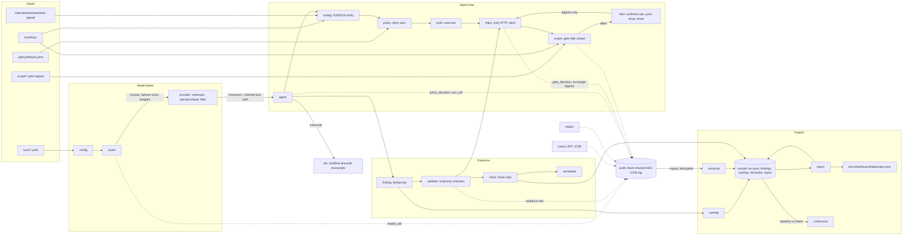

# Architecture

`docs/architecture.mmd` is the diagram source; GitHub renders it below. This page reads it left to right.

Every box is a package under `internal/` (or a directory in the repo), and
every arrow is a Go call or a file. There is no hidden service.

## Inputs

Four signed or committed inputs enter the harness: a run configuration
(`runs/*.yaml`: providers, routes, budgets, prices), the policy document
(`policy/default.yaml`), a signed scope document that names the authorized
targets, and the trust store of public keys that verifies tool manifests
and scope signatures. Manifests under `internal/tools/manifests` are signed
with the same keys (ADR 0003).

## Model plane

`config` loads the run file. `router` picks a candidate per task kind,
enforces per-run, per-model and per-task USD caps before each call, and
fails over at most once on a retryable transport error (ADR 0006). The
`provider` packages speak to the Anthropic SDK, OpenAI-compatible servers
(including a local llama-server) and a scripted fake used in CI. A refusal
is returned as data and never retried (ADR 0009).

## Agent loop

`agent` runs the turn loop. Each tool call the model emits passes through
`toolsig` (is the manifest signed by a trusted key?), `policy` (deny wins,
default deny, agent boundaries, dangerous capability combinations), then
`tools` executes it. Any network access goes through `httpx`, the only HTTP
client in the module, which asks `scope` before every request and every
redirect. The gate fails closed (ADR 0008). Allowed requests reach the lab
services: `synthetic-ops` (owned, complete ground truth), Juice Shop, DVWA.
Transcripts go to `zdr.NullSink` and are discarded (ADR 0005).

## Evidence

`finding` derives a deterministic id and dedup key from lab, class, method,
templated path and parameter (ADR 0007). `validate` runs read-only checkers
through the same gated client and is the only path from `theorized` to
`validated` or `refuted` (ADR 0010). `chain` derives attack paths with a
fixed rules table (ADR 0011). `remediate` drafts fixes into the results
directory and never touches a target.

## Audit

Every box on the left writes to `audit`: `model_call` from the router (with
claimed tool call ids and argument digests), `policy_decision` and
`tool_call` from the agent, `gate_decision` and exchange digests from
`httpx`, evidence references from `validate`. Records are canonical JSON
(`canon`, RFC 8785), pass `redact`, and are AES-GCM encrypted in a hash
chain (ADR 0004). Bodies have no field to live in.

## Publish

`overlap` computes the cross-model matrix from finding files. `reconcile`
joins the audit log's transcript side (claimed tool calls) against its
control-plane side (executed tool calls) and downgrades findings whose
evidence the control plane does not support. `report` renders run.json,
findings and the reconciliation into Markdown and into the dashboard rows
under `docs/dashboard/data/`. `continuous` diffs the latest run against
`results/baseline.json` and produces the drift verdict (ADR 0013). All of
it lands in `results/<date>-<run>/` next to the CI run that produced it
(ADR 0012).
